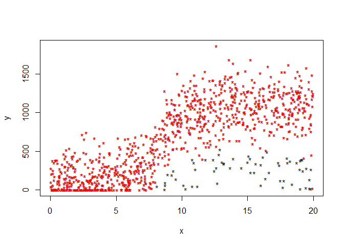

<!-- README.md is generated from README.Rmd. Please edit that file -->

# slmwclf

<!-- badges: start -->
<!-- badges: end -->

Segmented linear model with changeable loss function.

The goal of slmwclf is to fit for segmented linear model, where not
constrained by L2 loss function (as how package ‘segmented’ does).

Here is a list of situations where this package may be useful:

1.  You are confined by a indicator, and different customer applies
    different explanation of this indicator;
2.  Some samples are deviated under a rough criterion, to whom a
    specially-designed loss may help to resolve;
3.  One main/some feature explains most of the effect, and other
    features count limited weights;
4.  Randomly try different loss functions.

## Installation

Package *slmwclf* is in <https://github.com/jwwangars/slmwclf>.

## Example

### One segmented variable operation

This is a basic example which shows you how to solve a common problem
within one segmented variable:

``` r
library(slmwclf)
temp = data_generator(1000,55,gen_type = 'chaos&cut')#simulated data
model_1 = SLM_construct(temp[,1],temp[,2],
                        fixed_psi = c(2,6,8,10), loss_function = L2)
print(model_1$y)
#> [1] 147.1483 216.1691 424.1525 978.4060
predict_model(model_1, c(0,1,10,100,0.5,-1333))
#> [1]    130.3266    138.7374    978.4060    897.2454    134.5320 -11081.3004
plot(temp[,1],temp[,2]) 
draw_lines_model(model_1,'red')
```



### Multivariable segmented linear network

An extension for one-dimension segmented linear model. In
*n*-dimensional space, specify cuts for each dimension (see the *cuts*
below). With each value of *cuts* setted, a new point-value can be
predicted with weighted average by its 2^n neighbors.

For compatibility of one-dimension, the weights above is chosen to be
inverse-proportionally to the L2-distance between the point and its
neighbors:

*\\hat{y} = \[\\sum\_{i\\in 1:2^n} y_i/d_i\]/\\\[sum\_{i\\in 1:2^n}
1/d_i\]*

there the distance *d* derives by Euclid metrics:

*d = \\sqrt{\\sum\_{i\\in 1:n}(\\omega_i\\Delta x_i)^2}*

where *\\omega_1 = 1* as the first-dimension metric.

Thus the output contains two parts: point values of *cuts* and distance
metrics.

``` r
temp = data_generator(1000,55,gen_type = 'chaos&cut')
y = temp[,2]
one_trial = temp[,-2]
cuts = list(c(-2,4,8,12,21),c(-10,3,16,30),c(0,33,67,100))
tp2_output = msl_network(x = one_trial, y = y, cuts = cuts,
   loss = L1, iter_ctrl = list(iter.max=4, trace = 1))
#>   0:     417125.30:  636.645  636.645  636.645  636.645  636.645  636.645  636.645  636.645  636.645  636.645  636.645  636.645  636.645  636.645  636.645  636.645  636.645  636.645  636.645  636.645  636.645  636.645  636.645  636.645  636.645  636.645  636.645  636.645  636.645  636.645  636.645  636.645  636.645  636.645  636.645  636.645  636.645  636.645  636.645  636.645  636.645  636.645  636.645  636.645  636.645  636.645  636.645  636.645  636.645  636.645  636.645  636.645  636.645  636.645  636.645  636.645  636.645  636.645  636.645  636.645  636.645  636.645  636.645  636.645  636.645  636.645  636.645  636.645  636.645  636.645  636.645  636.645  636.645  636.645  636.645  636.645  636.645  636.645  636.645  636.645 0.500000 0.500000
#>   1:     411384.77:  634.443  632.019  636.047  639.441  638.455  632.719  629.240  635.488  642.659  640.318  632.656  628.448  635.325  644.454  641.225  634.922  632.260  635.460  640.380  639.261  633.247  629.905  635.409  644.482  641.991  629.823  623.008  634.393  650.142  646.732  629.052  619.775  635.634  652.673  645.959  632.172  627.351  634.797  643.994  641.927  632.721  629.588  636.612  647.028  643.376  629.790  622.913  634.624  653.747  648.871  629.623  621.529  632.765  652.552  646.879  631.917  627.597  634.502  644.031  642.816  633.778  632.444  636.764  641.024  639.799  632.058  628.959  635.611  644.786  642.439  633.507  629.394  634.331  643.932  641.592  634.903  633.022  635.771  640.813  639.742 0.500000 0.500000
#>   2:     328919.14:  603.283  566.549  627.583  679.020  664.086  577.148  524.429  619.117  727.789  692.322  576.204  512.423  616.652  748.286  701.972  610.542  570.192  618.687  687.397  672.416  585.156  534.506  617.914  755.422  717.675  533.264  429.982  602.523  841.194  789.513  521.587  380.982  621.325  877.793  776.142  568.867  495.810  608.645  746.280  715.047  577.188  529.708  636.153  794.010  738.663  532.768  428.551  606.031  895.826  821.928  530.239  407.575  577.854  877.715  791.739  564.999  499.529  604.177  748.590  730.167  593.200  572.987  638.447  703.010  684.456  567.141  520.176  620.978  760.028  724.463  589.101  526.761  601.583  747.087  711.616  610.247  581.746  623.401  699.820  683.593  0.00000  0.00000
#>   3:     315813.27:  599.399  556.975  624.672  685.858  668.209  569.039  504.224  614.586  742.310  699.583  568.167  489.218  611.223  764.423  710.669  607.064  558.257  614.615  695.385  677.928  578.735  518.024  614.758  774.332  729.943  519.664  393.389  598.280  875.931  810.421  507.440  336.058  616.235  912.800  794.628  561.711  471.418  603.497  763.592  725.333  569.180  509.710  637.137  819.818  753.983  519.227  390.997  603.480  938.574  848.314  516.824  367.940  569.444  914.621  813.372  556.722  477.074  599.147  767.441  741.621  587.642  560.355  639.375  716.150  691.606  558.704  498.895  618.073  781.645  737.193  581.969  508.345  593.994  765.249  723.302  605.794  572.067  619.823  709.903  690.190  0.00000  0.00000
#>   4:     278370.86:  508.929  333.995  556.859  845.130  764.227  380.188  33.5743  509.036  1080.55  868.707  380.988 -51.3236  484.758  1140.27  913.234  526.059  280.254  519.776  881.439  806.311  429.188  134.136  541.255  1214.77  1015.69  202.903 -458.980  499.448  1685.06  1297.37  177.957 -710.370  497.652  1728.17  1225.17  395.058 -96.7391  483.571  1166.83  964.885  382.682  43.8754  660.066  1420.94  1110.82  203.863 -483.752  544.098  1934.26  1462.89  204.379 -555.273  373.576  1774.21  1317.24  363.964 -45.9690  481.979  1206.53  1008.36  458.213  266.106  660.986  1022.24  858.131  362.213  3.18388  550.408  1285.17  1033.68  415.861  79.3741  417.230  1188.29  995.512  502.079  346.622  536.466  944.770  843.827 0.000855916 0.000851179
#>   4:     278370.86:  508.929  333.995  556.859  845.130  764.227  380.188  33.5743  509.036  1080.55  868.707  380.988 -51.3236  484.758  1140.27  913.234  526.059  280.254  519.776  881.439  806.311  429.188  134.136  541.255  1214.77  1015.69  202.903 -458.980  499.448  1685.06  1297.37  177.957 -710.370  497.652  1728.17  1225.17  395.058 -96.7391  483.571  1166.83  964.885  382.682  43.8754  660.066  1420.94  1110.82  203.863 -483.752  544.098  1934.26  1462.89  204.379 -555.273  373.576  1774.21  1317.24  363.964 -45.9690  481.979  1206.53  1008.36  458.213  266.106  660.986  1022.24  858.131  362.213  3.18388  550.408  1285.17  1033.68  415.861  79.3741  417.230  1188.29  995.512  502.079  346.622  536.466  944.770  843.827 0.000855916 0.000851179
#> iteration limit reached without convergence (10)
print(predict_msln(tp2_output,one_trial)[1:5])
#> [1] -400.15933   21.73517 1176.02668 1054.46654  129.96481
plot(y, tp2_output$fitted_values)
lines(c(0,1500),c(0,1500),col='red')
```


### Loss functions

This package contains the following loss functions: L1, L1_shrink, L2,
sim_sigmoid_soft. Note that sim_sigmoid_hard is also a loss function,
however sometimes it interrupts iteration, please use sim_sigmoid_soft
instead.

You can check loss function as:

``` r
sim_sigmoid_soft(1:10,c(3,5))
#>  [1] 0.05315114 0.07446795 0.12786157 0.25350602 0.50000000 0.78918171
#>  [7] 0.94684886 0.99080629 0.99879492 0.99987661
```

Creating your own loss function within ‘SLM_construct’:

Suppose the loss function has super-parameter as **a,b,c**, or we say
**L(x\|a,b,c)**. Then the new loss function should have 2 input
parameters, the first is the independent variable, which here is the
error **x**, the second one is ALL of the super-parameter.

For this particular example, it comes as:

**L(x) = function(x,c(a,b,c)){other codes … }**

Just as how *sim_sigmoid_soft* does.

You can use only one input if there is no super-parameter. Like **L(x) =
function(x){…}**.

### Other functions

Two other functions in this package do the data-cleansing and calculate
the disperse-level:

``` r
temp1 = data_sieve(temp[,1],temp[,2],c(0.7,0.85,500),if_plot = FALSE)
disperse_level(temp[,1],temp[,2])#3.71
#> [1] 3.710436
disperse_level(temp1$x,temp1$y)#3.51
#> [1] 3.515456
```

## Update comment

v0.1.1: Function ‘SLM_construct’ to multivariate input

v0.1.2: Add method of multivariate segmented linear network

v0.1.3: Fix bugs of *SLM_construct* when add 2 variables, and
*draw_line_model* setting *minor_fit* to NULL
